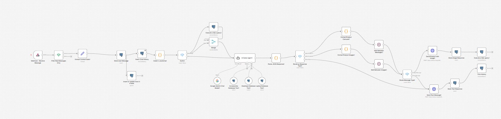

# 💻 AI Laptopwala – WhatsApp Automatic Sales Agent

An intelligent, fully autonomous WhatsApp automation built with **n8n** and **Google Gemini (PaLM)**. This AI agent acts as a virtual shop owner for **AI Laptop Wala**, automatically classifying customer intents (Sales vs. Service), fetching live database inventory (Laptops, Desktops, and Accessories), and sending dynamically formatted product catalogs directly to customers via WhatsApp.

---

## 📸 Workflow Architecture View


*(Note: To see the workflow diagram here, save an image of your workflow canvas as `workflow.png` in this directory)*

---

## 🚀 Key Features

* **Intelligent Intent Classification:** Automatically detects whether a customer is looking for a repair/service or inquiring about purchasing products using Hindi/Hinglish/English keyword analysis.
* **Persistent Chat Memory:** Connects to a PostgreSQL database (`chat_messages` table) to store user conversations and pass previous context seamlessly to the Gemini Langchain Agent.
* **Self-Operating Langchain Agent:** Employs the Gemini AI model powered by custom `n8n-nodes-base.postgresTool` tools to interact directly with Three live inventory tables:
  * 💻 `Laptops` (filters by stock, RAM, price, etc.)
  * 🖥️ `Desktops` (filters by generation, condition, price, etc.)
  * 🔌 `Accessories` (smart matching for chargers, screens, and cables)
* **Smart Output Routing Engine:** Intelligently figures out if the AI returned standard text, a single product with images, or a multi-device slider carousel. 
* **Custom Media Delivery & Delays:** Uses the `wbuz.in` WhatsApp API to send beautiful, templated image captions. It also dynamically injects delay nodes (2-3 seconds per message) so WhatsApp doesn't block the number for spamming!
* **Safe Mode Security:** Hides credential IDs and API keys via `.env` file referencing.

---

## ⚙️ Workflow Breakdown

1. **Webhook - Receive Message**: An HTTP POST listener capturing incoming WhatsApp payload events from wbuz.in.
2. **Filter Real Messages Only**: Ensures the payload contains an actual body or media message, discarding blank or system webhooks.
3. **Data Extraction & Storage**:
   * Extracts the `contact_uid`, `phone_number`, and `messageText`.
   * Inserts the incoming user query into the PostgreSQL `chat_messages` table for continuous history logging.
4. **Context Gathering**: Retrieves the last 20 messages specifically matching that `contact_uid` to feed memory into the AI.
5. **AI Sales Agent (Google Gemini)**: 
   * A heavy Langchain system prompt enforces business rules (e.g., ONLY suggesting items where `Stock_Quantity > 0`, ignoring stock filters for accessories).
   * Converses locally, queries databases seamlessly, and formats a robust JSON payload containing `{ message, products, productType, showImages }`.
6. **Data Parsers & Formatting Codes**: 
   * Checks the AI JSON to generate high-converting, dynamic captions based on urgency (e.g., `🔥 *Only 2 left!*`).
   * Appends shop address, phone number, and social links seamlessly to the bottom of message responses.
7. **Execution Routing & API Calls**: 
   * A Switch node splits traffic into `Image Message` vs. `Text Message` pipelines.
   * Leverages custom HTTP nodes pushing `Bearer` authorization headers to Wbuz.in to execute the final WhatsApp delivery.
8. **Logging Response**: Finally, pushes the assistant's AI reply back to the PostgreSQL history database and trims old conversations.

---

## 🛠 Setup & Installation

Follow these steps to safely run this workflow locally or on your own server without accidentally exposing your API keys:

1. **Import the Workflow:** Open n8n, click "Import from file", and select `automation.json`.
2. **Environment File (`.env`):** Make sure your `.env` file consists of the following structure before importing the workflow, so n8n can map the expressions:
   ```env
   # WBUZ WhatsApp API Details
   WBUZ_API_URL=https://wbuz.in/api/...
   WBUZ_API_TOKEN=your_token_here
   
   # Internal n8n Credential UUIDs
   POSTGRES_CREDENTIAL_ID=your_postgres_credential_id
   GEMINI_CREDENTIAL_ID=your_gemini_credential_id
   ```
3. **Connect Credentials:** Go into n8n's "Credentials" tab. Set up your **PostgreSQL Database** and your **Google Gemini(PaLM) API** accounts if you haven't yet, and replace the IDs inside your `.env` file with whatever your n8n instance assigned them!
4. **Activate Webhook:** Click "Activate" and hook your WBUZ application up to the production webhook URL provided by n8n.

---

## 🛡 Security Note

This repository utilizes a `.gitignore` file that deliberately ignores the `.env` file. Do **NOT** publish your `.env` file anywhere publicly or commit it, as it contains sensitive Bearer Tokens that will allow malicious bots to hijack your WhatsApp automation account.
